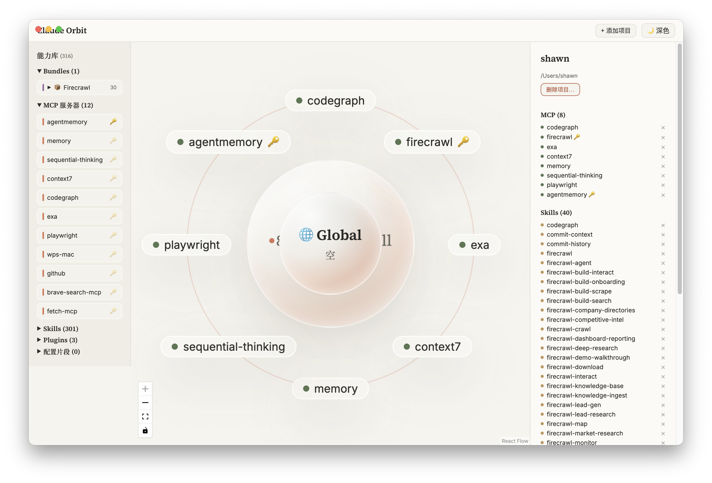

<p align="center">
  
</p>

<div align="center">

<a href="#中文">🇨🇳 中文</a> &nbsp;·&nbsp; <a href="#english">🇺🇸 English</a>

</div>

---

<h1 id="中文">🇨🇳 Claude Orbit</h1>

<p align="center">
  <em>Claude Code 项目的可视化能力装配台——拖拽 MCP、Skills、Plugins 到星球，即时生效，完美隔离。</em>
</p>

<p align="center">
  
  
  
  
  <a href="https://github.com/2365203723/claude-orbit/releases"></a>
</p>

### 为什么需要 Claude Orbit？

Claude Code 的 MCP 服务器、Skills、Plugins 默认**全局注入所有项目**。想让某个项目只用特定能力？这就是 Orbit 的用途。

```
❌ 没有 Orbit: 全局配置 → 所有项目都能用所有的东西
✅ 有了 Orbit:  每个项目只挂你需要的能力，真正隔离
```

### 功能

| 功能 | 说明 |
|------|------|
| 🔄 **反向导入** | 启动即扫描真实配置文件，自动发现已有项目和能力——无需手动配置 |
| 🪐 **星球图谱** | 项目 = 液态玻璃星球，能力 = 轨道卫星，拖拽即装配 |
| 📚 **能力库** | 左侧栏按 MCP / Skills / Plugins / Snippets / Bundles 分节 |
| ⚡ **拖拽即应用** | 拖到星球 → 立刻写盘，卫星变绿色——没有第二步"确认" |
| 📦 **Bundles** | 预组合能力包（如 Firecrawl = 1 MCP + 29 skills），一次拖拽全部挂载 |
| 🌐 **Global 星球** | 管理全局可见的能力（`~/.claude.json` 和 `~/.claude/skills/`） |
| 🎨 **双主题** | 浅色/深色——Claude 暖色调液态玻璃风格 |
| 🔒 **真隔离** | 所有 MCP 走 `~/.claude.json` 的 path-exact local scope，不写 `.mcp.json`（会被子目录继承泄漏） |
| 🔑 **密钥保护** | 环境变量在 UI 中遮罩显示，密钥只存在你本机 |
| ↩️ **撤销** | 悬停卫星出现 × 按钮；右侧详情面板也支持 |
| 💾 **自动备份** | 每次写入前备份到 `~/.claude-orbit/backups/<时间戳>/` |

### 快速开始

```bash
git clone git@github.com:2365203723/claude-orbit.git
cd claude-orbit
npm install
npm run dev      # Electron 开发模式
npm test         # 运行 101 个测试
npm run build    # 生产构建
```

**下载安装包：**

[📥 下载最新版本](https://github.com/2365203723/claude-orbit/releases) — macOS DMG / Windows EXE

```bash
npm run dist:mac    # macOS → DMG
npm run dist:win    # Windows → EXE
npm run dist:linux  # Linux → AppImage / deb
```

### 架构

```
Library → Desired State → Real Config Files
(能力库)   (state.json)    (~/.claude.json, project/.claude/*)
    ↑                          │
    └── 启动反向导入 ←──────────┘
```

**核心设计原则：**
- 所有 MCP 路由到 **`~/.claude.json` local scope**（`projects[path].mcpServers`），路径精确——**不写 `.mcp.json`**
- Skills → `<project>/.claude/skills/<id>` symlink
- Plugins → `<project>/.claude/settings.json`（`enabledPlugins`）
- 纯函数核心 + 副作用壳：所有逻辑可在无 Electron 环境测试

### 技术栈

| 层 | 技术 |
|---|------|
| 壳 | Electron 33 |
| UI | React 18 + React Flow 11 |
| 动画 | Motion (spring physics) |
| 语言 | TypeScript 5.6 全栈 |
| 测试 | Vitest — 101 个测试 |
| 构建 | electron-vite + electron-builder |

### 数据布局

| 路径 | 内容 |
|------|------|
| `~/.claude.json` | 项目级 MCP（local scope），由 Orbit 管理 |
| `<project>/.claude/skills/` | 项目 skill symlink |
| `<project>/.claude/settings.json` | 项目启用的插件 |
| `~/.claude-orbit/state.json` | 期望状态（assignments + 库索引） |
| `~/.claude-orbit/backups/` | 每次写入前的带时间戳备份 |

---

<h1 id="english">🇺🇸 Claude Orbit</h1>

<p align="center">
  <em>Visual capability assembly station for Claude Code — drag MCPs, Skills & Plugins onto project planets. Instantly applied, perfectly isolated.</em>
</p>

<p align="center">
  
  
  
  
  <a href="https://github.com/2365203723/claude-orbit/releases"></a>
</p>

### Why Claude Orbit?

Claude Code injects MCP servers, Skills, and Plugins into **every** project by default. Orbit gives you per-project isolation:

```
❌ Default:   global config → everything reaches every project
✅ With Orbit: drag & drop → project-specific, instant apply
```

### Features

| Feature | Detail |
|---------|--------|
| 🔄 **Reverse Import** | Auto-discovers existing projects and capabilities on first launch — zero setup |
| 🪐 **Planet Graph** | Projects = liquid-glass planets, capabilities = orbiting satellite badges |
| 📚 **Library Rail** | Browse MCPs / Skills / Plugins / Snippets / Bundles in categorized sections |
| ⚡ **Drag = Apply** | Drop onto a planet → written to disk immediately, satellite turns green |
| 📦 **Bundles** | Pre-grouped sets (e.g. Firecrawl = 1 MCP + 29 skills) — drag once, mount all |
| 🌐 **Global Planet** | Manage globally-available capabilities right from the canvas |
| 🎨 **Dual Theme** | Light / Dark — warm Claude-toned liquid glass |
| 🔒 **True Isolation** | Path-exact local scope in `~/.claude.json`; `.mcp.json` is never written (inheritance leak) |
| 🔑 **Secret Safety** | Credentials masked in UI, never in project-committable files |
| ↩️ **Undo** | Hover for × button, or use the detail panel |
| 💾 **Auto-backup** | Pre-write backups to `~/.claude-orbit/backups/<timestamp>/` |

### Quick Start

```bash
git clone git@github.com:2365203723/claude-orbit.git
cd claude-orbit
npm install
npm run dev      # Electron dev mode
npm test         # 101 tests
npm run build    # Production build
```

**Download installers:**

[📥 Download Latest](https://github.com/2365203723/claude-orbit/releases) — macOS DMG / Windows EXE

```bash
npm run dist:mac    # macOS → DMG
npm run dist:win    # Windows → EXE
npm run dist:linux  # Linux → AppImage / deb
```

### Architecture & Data Layout

Same as <a href="#架构">中文版</a> above. Pure-function core + side-effect shell — all logic testable without Electron.

---

<p align="center">
  <sub>Built for Claude Code power users who want fine-grained control over which capabilities reach which project.</sub>
  <br/>
  <sub>MIT · 2026</sub>
</p>
